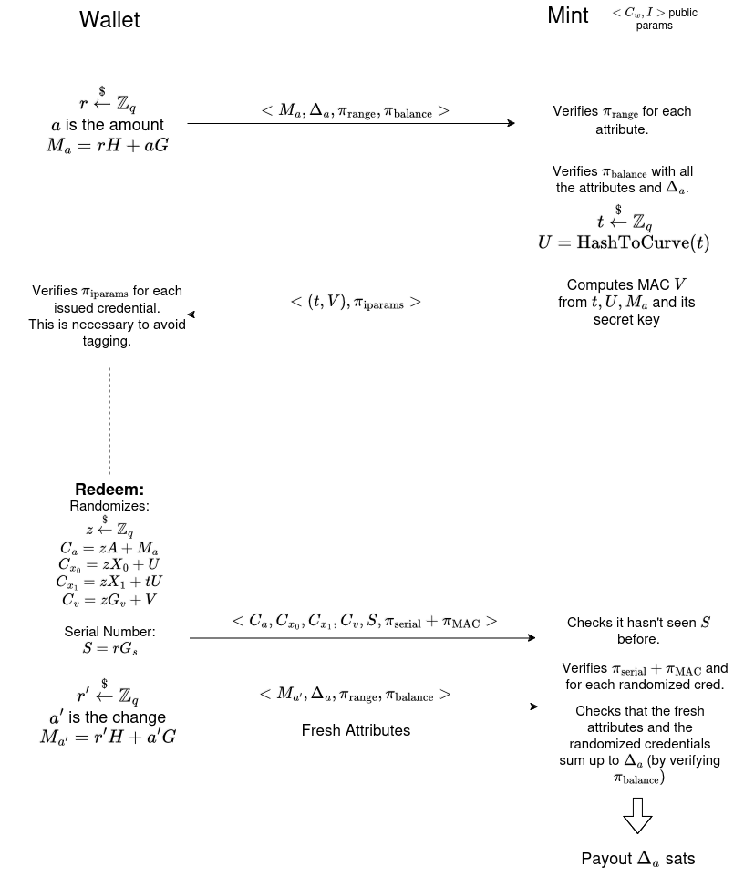

# Anonymous Credentials for Cashu

Experimental implementation of the core crypto behind a anonymous credentials enabled Mint.

### Things to know:
* Paper on KVAC used for CoinJoins: https://eprint.iacr.org/2021/206.pdf
* Gist about steps to take: https://gist.github.com/nothingmuch/08bac12fcb58417e71b762721e77a71c
* Deterministic Recovery: read `deterministic_recovery.md`
* Server/Mint can tweak the amounts encoded in the attributes: $M_a' = M_a + \delta G_\text{amount}$
* We are using $r$ as both the randomizing factor and the blinding factor:
  - different generators with unknown discrete log between them guarantees hiding.
  - Benefit: no $\pi_\text{serial}$ because not needed anymore.
  - $C_a$ becomes the serial

### Basic Protocol Diagram:

Will surely change nor it is particularly accurate.

